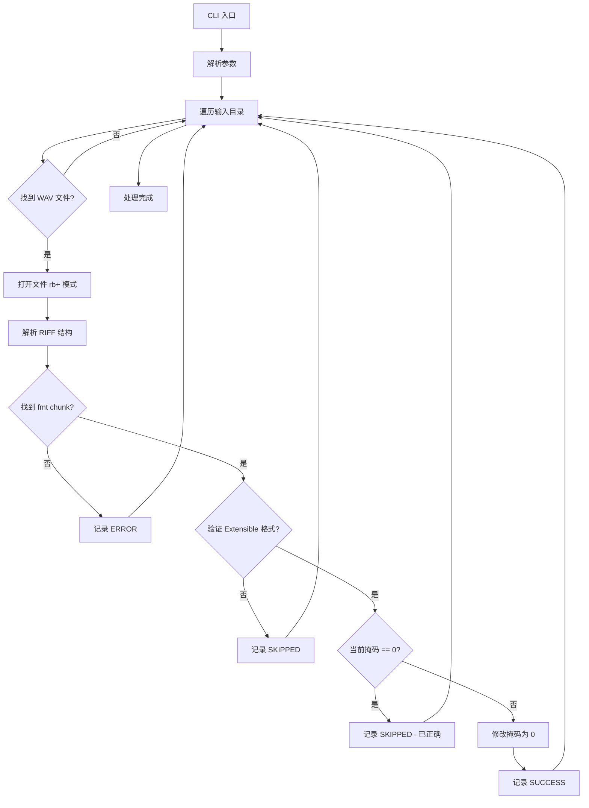

# Ambisonics WAV Channel Mask Fixer - 技术方案

## 1. 问题背景

### 1.1 核心问题
游戏音频中间件 Wwise 通过检查 WAV 文件头中的 `dwChannelMask` 来判断 4 通道文件是 Ambisonics (AmbiX) 格式还是 4.0 Surround 格式。DAW 导出的 4 通道 WAV 文件通常会被错误标记为环绕声掩码，导致 Wwise 无法正确识别。

### 1.2 解决方案
将 `WAVEFORMATEXTENSIBLE` 格式的 WAV 文件中的 `dwChannelMask` 强制修改为 `0x00000000` (KSAUDIO_SPEAKER_DIRECTOUT)，使 Wwise 将其识别为 Ambisonics 格式。

---

## 2. WAV 文件二进制结构

### 2.1 RIFF 容器结构
```
┌─────────────────────────────────────────────────────────┐
│ RIFF Header (12 bytes)                                  │
│   - ChunkID: "RIFF" (4 bytes)                           │
│   - ChunkSize: 文件大小 - 8 (4 bytes, Little-Endian)    │
│   - Format: "WAVE" (4 bytes)                            │
├─────────────────────────────────────────────────────────┤
│ fmt chunk (对于 Extensible 格式为 50 bytes)              │
│   - ChunkID: "fmt " (4 bytes)                           │
│   - ChunkSize: 40 (4 bytes, Little-Endian)              │
│   - WaveFormatEx 结构 (40 bytes)                        │
├─────────────────────────────────────────────────────────┤
│ 其他可选 chunks (bext, smpl, etc.)                      │
├─────────────────────────────────────────────────────────┤
│ data chunk                                              │
│   - ChunkID: "data" (4 bytes)                           │
│   - ChunkSize: 音频数据大小 (4 bytes)                    │
│   - 音频数据                                            │
└─────────────────────────────────────────────────────────┘
```

### 2.2 WAVEFORMATEXTENSIBLE 结构 (fmt chunk 数据部分)
```
偏移量  字段名                    大小    说明
────────────────────────────────────────────────────────────
0       wFormatTag              2       0xFFFE = Extensible
2       nChannels               2       通道数
4       nSamplesPerSec          4       采样率
8       nAvgBytesPerSec         4       字节率
12      nBlockAlign             2       块对齐
14      wBitsPerSample          2       位深度
16      cbSize                  2       扩展数据大小 = 22
18      wValidBitsPerSample     2       有效位数
20      dwChannelMask           4       ★ 声道掩码 (目标字段)
24      SubFormat               16      GUID
────────────────────────────────────────────────────────────
总计: 40 bytes
```

### 2.3 关键偏移量计算
- `fmt ` chunk 头部: 8 bytes (ChunkID + ChunkSize)
- `dwChannelMask` 在 fmt 数据内的偏移: 20 bytes
- **`dwChannelMask` 的绝对文件偏移** = `fmt ` chunk 起始位置 + 8 + 20

---

## 3. 二进制解析难点分析

### 3.1 字节序处理
- WAV 文件采用 **Little-Endian** (小端序)
- 使用 `struct` 模块时必须用 `<` 前缀
- 示例: `struct.unpack('<I', data)` 解析 4 字节无符号整数

### 3.2 Chunk 导航
- 每个 Chunk 的结构: `[ChunkID(4) | ChunkSize(4) | Data(ChunkSize)]`
- 需要循环读取直到找到 `fmt ` chunk
- 注意 `fmt ` 后面的空格字符 (ASCII 0x20)

### 3.3 格式验证
- 必须验证 `wFormatTag == 0xFFFE` (Extensible)
- 必须验证 `fmt ` chunk size == 40 (Extensible 格式固定大小)
- 非 Extensible 格式无法修改掩码

### 3.4 安全写入
- 使用 `rb+` 模式打开文件
- 只修改目标 4 字节，不触碰其他数据
- 写入前验证文件指针位置

---

## 4. 脚本架构设计



---

## 5. 模块划分

### 5.1 核心函数
| 函数名 | 功能 | 输入 | 输出 |
|--------|------|------|------|
| `find_fmt_chunk` | 定位 fmt chunk | 文件句柄 | fmt chunk 起始偏移或 None |
| `validate_extensible` | 验证 Extensible 格式 | 文件句柄, fmt 偏移 | bool, 通道数 |
| `read_channel_mask` | 读取当前声道掩码 | 文件句柄, fmt 偏移 | 掩码值 |
| `write_channel_mask` | 写入新声道掩码 | 文件句柄, fmt 偏移, 新值 | bool |
| `process_wav_file` | 处理单个 WAV 文件 | 文件路径, 输出路径 | 状态字符串 |
| `main` | CLI 入口 | argparse 参数 | None |

### 5.2 错误处理策略
- 文件打开失败 → `[ERROR] 无法打开文件`
- 非 RIFF 格式 → `[ERROR] 不是有效的 WAV 文件`
- 无 fmt chunk → `[ERROR] 找不到 fmt chunk`
- 非 Extensible 格式 → `[SKIPPED] 非 Extensible 格式`
- 掩码已为 0 → `[SKIPPED] 掩码已正确`
- 写入成功 → `[SUCCESS] 已修复`

---

## 6. CLI 参数设计

```
usage: ambisonics_fixer.py [-h] --input INPUT [--output OUTPUT] [--suffix SUFFIX]

参数:
  --input INPUT    输入文件夹路径 (必需)
  --output OUTPUT  输出文件夹路径 (可选，默认原地修改)
  --suffix SUFFIX  输出文件后缀 (可选，默认 _fixed，仅当指定 output 时生效)
```

---

## 7. 目录结构

```
g:/Coding/
├── proj_main/
│   └── ambisonics_wav_fixer/
│       ├── ambisonics_wav_fixer.py    # 主脚本
│       └── README.md                  # 使用说明
├── plans/
│   └── ambisonics_wav_fixer_plan.md   # 技术方案文档
└── ext_files/                         # 外部资源文件 (预留)
```

---

## 8. 预期输出示例

```
=== Ambisonics WAV Channel Mask Fixer ===
输入目录: ./input_wavs
输出目录: ./output_wavs (原地修改)

[1/5] Processing: ambience_4ch.wav
      [SUCCESS] 掩码已从 0x00000037 修改为 0x00000000

[2/5] Processing: music_4ch.wav
      [SKIPPED] 掩码已为 0，无需修改

[3/5] Processing: stereo_file.wav
      [SKIPPED] 非 4 通道文件 (2 通道)

[4/5] Processing: non_extensible.wav
      [SKIPPED] 非 Extensible 格式

[5/5] Processing: corrupt.wav
      [ERROR] 找不到 fmt chunk

=== 处理完成: 1 成功, 3 跳过, 1 错误 ===